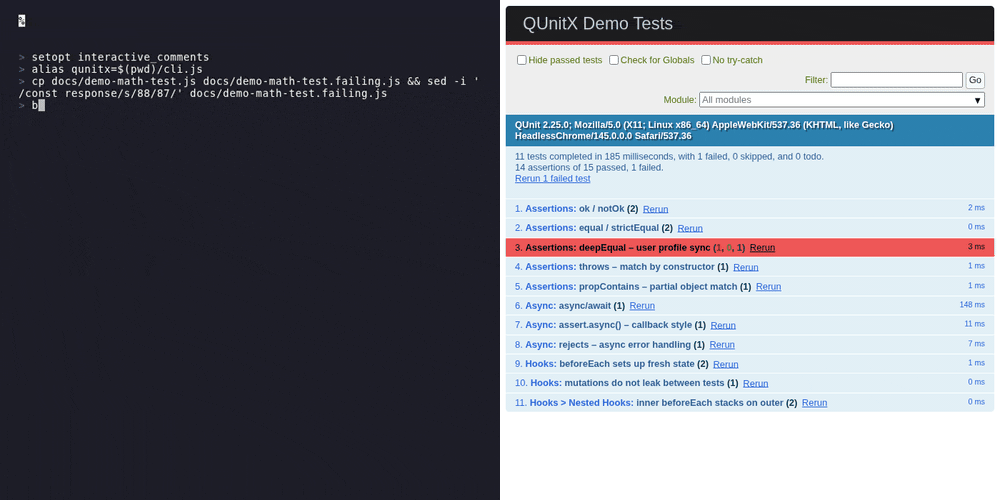

# qunitx-cli

[](https://github.com/izelnakri/qunitx-cli/actions/workflows/ci.yml)
[](https://codecov.io/gh/izelnakri/qunitx-cli)
[](https://www.npmjs.com/package/qunitx-cli)
[](https://www.npmjs.com/package/qunitx-cli)
[](LICENSE)

Browser-based test runner for [QUnitX](https://github.com/izelnakri/qunitx) — bundles your JS/TS tests
with esbuild, runs them in a headless browser via [Playwright](https://playwright.dev), and streams TAP
output to the terminal.



## Features

- Runs `.js`, `.ts`, `.jsx`, and `.tsx` test files in headless Chrome, Firefox, or WebKit (Playwright + esbuild)
- TypeScript and JSX work with zero configuration — esbuild handles transpilation, including the React 17+ automatic JSX runtime
- Bring your own esbuild plugins through `package.json` for `.vue`, `.svelte`, and other custom loaders
- Inline source maps for accurate stack traces pointing to original source files
- Streams TAP-formatted output to the terminal in real time
- Concurrent mode (default) splits test files across all CPU cores for fast parallel runs
- `--watch` mode re-runs affected tests on file change
- `--failFast` stops the run after the first failing test
- `--debug` prints the local server URL and pipes browser console to stdout
- `--open` / `-o` opens the test output in the same browser the tests run in as soon as the bundle is ready; `--open=brave` opens in a specific binary instead
- `--before` / `--after` hook scripts for server setup and teardown
- `--timeout` controls the maximum ms to wait for the full suite to finish
- `--port` defaults to 1234 and auto-increments if taken; fails fast if an explicit port is unavailable
- `--browser` flag to run tests in Chromium, Firefox, or WebKit
- `--version` / `-v` prints the installed version
- Optional daemon mode (`qunitx daemon start`) keeps Chrome and the esbuild context warm across runs — roughly halves the wall-clock time of repeated invocations
- Docker image for zero-install CI usage

## Installation

Requires Node.js >= 24.

```sh
npm install --save-dev qunitx-cli
```

Or run without installing:

```sh
npx qunitx test/**/*.js
```

With Docker — no install needed:

```sh
docker run --rm -v "$(pwd):/code" -w /code ghcr.io/izelnakri/qunitx-cli:latest npx qunitx test/**/*.js
```

With Nix:

```sh
nix profile install github:izelnakri/qunitx-cli
```

## Usage

```sh
# Single file
qunitx test/my-test.js

# Multiple files / globs
qunitx test/**/*.js test/**/*.ts

# TypeScript — no tsconfig required
qunitx test/my-test.ts

# Watch mode: re-run on file changes
qunitx test/**/*.js --watch

# Stop on the first failure
qunitx test/**/*.js --failFast

# Print the server URL and pipe browser console to stdout
qunitx test/**/*.js --debug

# Open output in the test browser as soon as the bundle is ready
qunitx test/**/*.js --open

# Open output in a specific browser binary instead
qunitx test/**/*.js --open=brave
qunitx test/**/*.js --open=google-chrome-lts

# Custom timeout (ms)
qunitx test/**/*.js --timeout=30000

# Run a setup script before tests (can be async — awaited automatically)
qunitx test/**/*.js --before=scripts/start-server.js

# Run a teardown script after tests (can be async)
qunitx test/**/*.js --after=scripts/stop-server.js

# Run in Firefox or WebKit instead of Chromium
qunitx test/**/*.js --browser=firefox
qunitx test/**/*.js --browser=webkit
```

> **Prerequisite for Firefox / WebKit:** install the Playwright browser binaries once:
>
> ```sh
> npx playwright install firefox
> npx playwright install webkit
> ```

## Daemon mode

**`qunitx daemon start` is optional.** Set `QUNITX_DAEMON=1` once (in your shell, `.env`, or a CI step) and plain `qunitx <file>` invocations auto-spawn the daemon on first use, then transparently route through it on every run after — no extra commands, no flags, nothing to remember between invocations. The explicit `daemon start` / `stop` subcommands exist only for when you want to control the lifecycle yourself.

What it does: cold-start cost dominates a single `qunitx` run — launching Chrome, loading playwright-core, and creating an esbuild incremental context together account for most of the wall-clock time on a small suite. The daemon keeps all three resources alive across runs so subsequent invocations skip them entirely — roughly **2-3× faster** on repeated runs of the same suite.

A single one-off run won't get faster from spinning the daemon up; it's an opt-in optimization aimed at two situations:

- **Local TDD loops.** Export `QUNITX_DAEMON=1` in your shell profile (or run `qunitx daemon start` once at the top of your session) and forget about it — subsequent runs reuse the daemon automatically until you `daemon stop` or 30 idle minutes pass.
- **Monorepo CI** where each package shells out to `qunitx` separately. Set `QUNITX_DAEMON=1` for the job and a single daemon is auto-spawned and reused across every package's invocation.

```sh
# Start a background daemon for this project
qunitx daemon start

# Run tests as usual — the cli auto-detects the daemon and routes through it
qunitx test/**/*.ts

# Stop it when you're done
qunitx daemon stop
```

`--watch` and `--open` manage their own browser lifecycle and bypass the daemon automatically. Single-invocation CI jobs (where `CI=1` is set) also bypass it by default — `QUNITX_DAEMON=1` overrides if you want it on anyway.

### Daemon subcommands

```sh
qunitx daemon start    # Launch a detached daemon for this cwd (idempotent)
qunitx daemon stop     # Ask the running daemon to exit and wait until it has
qunitx daemon status   # Print the live daemon's pid, socket, and uptime
qunitx daemon restart  # Stop + start in one step
```

### How it works

`qunitx daemon start` spawns a detached Node process listening on a per-project Unix socket (named pipe on Windows). Subsequent `qunitx` invocations detect the live socket and forward `argv` + `cwd` + `env` to the daemon; the daemon executes the run in-process and streams TAP back to your terminal. Ctrl+C is forwarded — the daemon abandons the in-flight run cleanly and stays up for the next one. A single daemon serves one run at a time; concurrent invocations queue in arrival order.

Running `qunitx daemon start` upfront is optional. With `QUNITX_DAEMON=1` set in your environment, a plain `qunitx <file>` invocation will spawn the daemon on its own when it doesn't find one already running — so the very first run pays the spawn cost and every run after that is warm. Without `QUNITX_DAEMON=1`, the cli skips auto-spawn and just runs locally; `qunitx daemon start` then becomes the explicit way to opt in.

## Writing Tests

qunitx-cli runs [QUnitX](https://github.com/izelnakri/qunitx) tests — a superset of QUnit with async
hooks, concurrency control, and test metadata.

Migrating from QUnit? Change a single import:

```js
// before
import { module, test } from 'qunit';
// after
import { module, test } from 'qunitx';
```

Example test file — ES modules, npm imports, and nested modules all work out of the box:

```js
// some-test.js (TypeScript is also supported)
import { module, test } from 'qunitx';
import $ from 'jquery';

module('Basic sanity check', (hooks) => {
  test('it works', (assert) => {
    assert.equal(true, true);
  });

  module('More advanced cases', (hooks) => {
    test('deepEqual works', (assert) => {
      assert.deepEqual({ username: 'izelnakri' }, { username: 'izelnakri' });
    });

    test('can import ES & npm modules', (assert) => {
      assert.ok(Object.keys($));
    });
  });
});
```

Run it:

```sh
# Headless Chromium (default, recommended for CI)
qunitx some-test.js

# With browser console output
qunitx some-test.js --debug

# TypeScript — no config needed
qunitx some-test.ts
```

## Configuration

All CLI flags can also be set in `package.json` under the `qunitx` key, so you don't have to repeat them on every invocation:

```json
{
  "qunitx": {
    "inputs": ["test/**/*-test.js", "test/**/*-test.ts"],
    "htmlPaths": ["test/tests.html"],
    "extensions": ["js", "ts", "jsx", "tsx"],
    "output": "tmp",
    "timeout": 20000,
    "failFast": false,
    "port": 1234,
    "browser": "chromium",
    "plugins": []
  }
}
```

| Key          | Default                      | Description                                                                                                                                                                  |
| ------------ | ---------------------------- | ---------------------------------------------------------------------------------------------------------------------------------------------------------------------------- |
| `inputs`     | `[]`                         | Glob patterns, file paths, or directories to use as test entry points. Merged with any paths given on the CLI.                                                               |
| `htmlPaths`  | `[]`                         | Optional HTML templates to run tests inside. Any listed `.html` file that contains `{{qunitxScript}}` or other handlebars-style tokens is treated as a test runner template. |
| `extensions` | `["js", "ts", "jsx", "tsx"]` | File extensions tracked for test discovery (directory scans) and watch-mode rebuild triggers. Add `"mjs"`, `"cjs"`, or any other extension your project uses.                |
| `output`     | `"tmp"`                      | Directory where compiled test bundles are written.                                                                                                                           |
| `timeout`    | `20000`                      | Maximum milliseconds to wait for the full test suite before timing out.                                                                                                      |
| `failFast`   | `false`                      | Stop the run after the first failing test.                                                                                                                                   |
| `port`       | `1234`                       | Preferred HTTP server port. qunitx auto-selects a free port if this one is taken.                                                                                            |
| `browser`    | `"chromium"`                 | Browser engine to use: `"chromium"`, `"firefox"`, or `"webkit"`. Overridden by `--browser` on the CLI.                                                                       |
| `plugins`    | `[]`                         | esbuild plugin specifiers loaded from your `node_modules` and applied to the test bundle. See [esbuild plugins](#esbuild-plugins).                                           |

CLI flags always override `package.json` values when both are present.

## JSX / TSX

`.jsx` and `.tsx` files are picked up automatically — no configuration needed. The bundle uses esbuild's automatic JSX runtime so React 17+ "no `import React`" code just works:

```tsx
// test/button-test.tsx
import { module, test } from 'qunitx';
import { flushSync } from 'react-dom';
import { createRoot } from 'react-dom/client';
import { Button } from '../src/button.tsx';

module('Button', (hooks) => {
  let container;
  hooks.beforeEach(() => {
    container = document.createElement('div');
    document.body.appendChild(container);
  });
  hooks.afterEach(() => container.remove());

  test('renders the label', (assert) => {
    flushSync(() => createRoot(container).render(<Button label="Save" />));
    assert.equal(container.querySelector('button').textContent, 'Save');
  });
});
```

Vue, Preact, Solid, and other JSX dialects work via a one-line override at the top of each file:

```tsx
/** @jsxImportSource vue */
import { createApp } from 'vue';
// ...JSX uses vue/jsx-runtime instead of react/jsx-runtime
```

You can also set `compilerOptions.jsxImportSource` in your `tsconfig.json` to apply the override across a directory.

## esbuild plugins

For file formats esbuild does not handle natively (e.g. `.vue` SFCs, `.svelte`), declare plugin specifiers in `package.json#qunitx.plugins`. qunitx dynamic-imports each one from your project's `node_modules` and passes it to the build:

```json
{
  "qunitx": {
    "extensions": ["js", "ts", "jsx", "tsx", "vue"],
    "plugins": [
      "esbuild-plugin-vue-next",
      ["esbuild-svelte", { "compilerOptions": { "css": "injected" } }]
    ]
  }
}
```

Each entry is one of:

| Form                            | Behavior                                                                                                                                                   |
| ------------------------------- | ---------------------------------------------------------------------------------------------------------------------------------------------------------- |
| `"<package-name>"`              | Imports the package. If the default export is a function, it's called with no arguments to produce the plugin; otherwise the export is used as the plugin. |
| `["<package-name>", <options>]` | Same, but the factory is called with `<options>` as its only argument. Use this form to pass plugin-specific configuration.                                |
| `"./relative/plugin.js"`        | Loads a plugin you wrote yourself. Resolved against the project root (where your `package.json` lives).                                                    |

Don't forget to add the plugin's file extension(s) to `qunitx.extensions` so directory scans and watch-mode rebuilds pick them up.

### Environment variables

| Variable         | Description                                                                                                                                                                                           |
| ---------------- | ----------------------------------------------------------------------------------------------------------------------------------------------------------------------------------------------------- |
| `CHROME_BIN`     | Path to the Chrome/Chromium executable. Required on systems where Chrome is not on `PATH` (e.g. many CI environments). Set automatically when using `browser-actions/setup-chrome` in GitHub Actions. |
| `QUNITX_BROWSER` | Browser engine to use (`chromium`, `firefox`, `webkit`). Equivalent to `--browser` on the CLI. Useful in CI matrix jobs.                                                                              |

If you do not provide any HTML template, qunitx falls back to its built-in `test/tests.html` boilerplate internally, so `qunitx init` is optional.

You can also pass a custom HTML file on the CLI:

```sh
qunitx test/**/*.js custom.html
```

If that file contains `{{qunitxScript}}`, qunitx injects the runner script block at that exact spot. If it contains other handlebars-style tokens (e.g. `{{applicationName}}`), qunitx still treats it as a custom runner template and injects the runner before `</body>`.

The `{{qunitxScript}}` placeholder is replaced with a `<script>` tag containing the WebSocket runtime, QUnit event hooks, and the bundled test code.

## CLI Reference

```
Usage: qunitx [files/folders...] [options]

Options:
  --watch             Re-run tests on file changes
  --failFast          Stop after the first failure
  --debug             Print the server URL; pipe browser console to stdout
  --timeout=<ms>      Max ms to wait for the suite to finish  [default: 20000]
  --output=<dir>      Directory for compiled test assets     [default: ./tmp]
  --extensions=<...>  Comma-separated file extensions to track  [default: js,ts,jsx,tsx]
  --before=<file>     Script to run (and optionally await) before tests start
  --after=<file>      Script to run (and optionally await) after tests finish
  --open, -o          Open output in the test browser as soon as the bundle is ready
  --open=<binary>     Open output in a specific browser binary (e.g. brave, google-chrome-lts)
  --port=<n>          HTTP server port (auto-selects a free port if taken)
  --browser=<name>    Browser engine: chromium (default), firefox, or webkit
```

## Timezone

The browser inherits the **OS system timezone** automatically — no Playwright `timezoneId` option is involved. The browser's `Intl.DateTimeFormat().resolvedOptions().timeZone` will match the timezone that Node.js itself reads from the OS.

### Setting a timezone for tests

| Platform    | How Chrome resolves the timezone                        | Override                                                                       |
| ----------- | ------------------------------------------------------- | ------------------------------------------------------------------------------ |
| **Linux**   | glibc reads `TZ` env var first, then `/etc/localtime`   | `TZ=America/New_York npx qunitx …` works                                       |
| **macOS**   | CoreFoundation reads the system timezone (ignores `TZ`) | Must set the system timezone: `sudo systemsetup -settimezone America/New_York` |
| **Windows** | Reads the registry timezone (ignores `TZ`)              | Must set the system timezone: `tzutil /s "Eastern Standard Time"`              |

On Linux, the `TZ` env var is the simplest way to run tests in a specific timezone:

```sh
TZ=UTC npx qunitx test/**/*.ts
TZ=America/Los_Angeles npx qunitx test/**/*.ts
TZ=Europe/Berlin npx qunitx test/**/*.ts
```

### CI pitfalls

GitHub Actions (and most CI providers) run with **UTC** by default on all platforms. This is usually what you want for reproducible test results. If your tests assert on specific local times or date formatting, be aware:

**Linux CI** — override with `TZ` in your workflow step:

```yaml
- run: npx qunitx test/**/*.ts
  env:
    TZ: America/New_York
```

**macOS CI** — `TZ` does not affect Chrome. Set the system timezone before running tests:

```yaml
- run: sudo systemsetup -settimezone America/New_York
- run: npx qunitx test/**/*.ts
```

**Windows CI** — same constraint, use `tzutil`:

```yaml
- run: tzutil /s "Eastern Standard Time"
- run: npx qunitx test/**/*.ts
```

If your test suite does not assert on local times or timezone-sensitive date formatting, none of this matters — the default UTC CI timezone is fine.

### Mocking dates and times in tests

For most cases you do not need to touch system settings or env vars at all. `Date`, `Intl`, and timers are plain browser globals — mock them in a qunitx `before` / `beforeEach` hook just like any other value:

```js
// test/some-test.ts
import { module, test } from 'qunitx';

module('Invoice formatting', (hooks) => {
  let realDate;

  hooks.before(() => {
    realDate = globalThis.Date;
    // Pin "now" to a fixed instant for the whole module
    const FIXED = new realDate('2024-06-01T12:00:00Z');
    globalThis.Date = class extends realDate {
      constructor(...args) {
        super(args.length ? args : [FIXED]);
      }
      static now() {
        return FIXED.getTime();
      }
    };
  });

  hooks.after(() => {
    globalThis.Date = realDate;
  });

  test('formats the current date correctly', (assert) => {
    assert.equal(new Date().toISOString().slice(0, 10), '2024-06-01');
  });
});
```

For richer control over timers (`setTimeout`, `setInterval`, `requestAnimationFrame`, …) use a fake-timer library such as [Sinon.JS](https://sinonjs.org/releases/latest/fake-timers/):

```js
import sinon from 'sinon';

module('Debounce logic', (hooks) => {
  let clock;

  hooks.before(() => {
    clock = sinon.useFakeTimers({ now: new Date('2024-06-01T00:00:00Z') });
  });
  hooks.after(() => {
    clock.restore();
  });

  test('fires after 300 ms', (assert) => {
    // clock.tick(300) advances fake time without waiting in real time
    clock.tick(300);
    assert.ok(/* your assertion */);
  });
});
```

If you need the mock active across the entire test run rather than inside a single module, put it in a `--before` script:

```js
// scripts/mock-date.js  (passed as: qunitx … --before=scripts/mock-date.js)
const realDate = globalThis.Date;
const FIXED = new realDate('2024-06-01T12:00:00Z');

globalThis.Date = class extends realDate {
  constructor(...args) {
    super(args.length ? args : [FIXED]);
  }
  static now() {
    return FIXED.getTime();
  }
};
```

This runs in the browser context before any test module loads, so every test in the run sees the mocked `Date` with no changes to the OS, no env vars, and no qunitx-cli configuration.

## Development

```sh
npm install
make check                      # lint + test (run before every commit)
make test                       # run full test suite (Chromium)
make test-firefox               # run browser tests with Firefox
make test-webkit                # run browser tests with WebKit
make test-all-browsers          # run full suite on all three browsers
make demo                       # regenerate docs/demo.gif
make release LEVEL=patch        # bump version, update changelog, tag, push
```

For a tight TDD loop on this repo (or any consuming project), run `qunitx daemon start` once at the top of your session — every subsequent `qunitx` invocation reuses the warm Chrome and esbuild context, roughly halving the wait-per-iteration. AI/LLM coding agents benefit even more, since their inner loop is dozens of `qunitx <file>` invocations per feature. Caveat: agents running inside containers or CI-style environments (GitHub Actions Copilot, sandboxed coding agents) often have `CI=1` set, which bypasses the daemon by default — set `QUNITX_DAEMON=1` in those environments to opt back in.

Use `--trace-perf` to print internal timing to stderr — useful when investigating startup or e2e regressions:

```sh
qunitx test/my-test.js --trace-perf
```

## License

MIT
