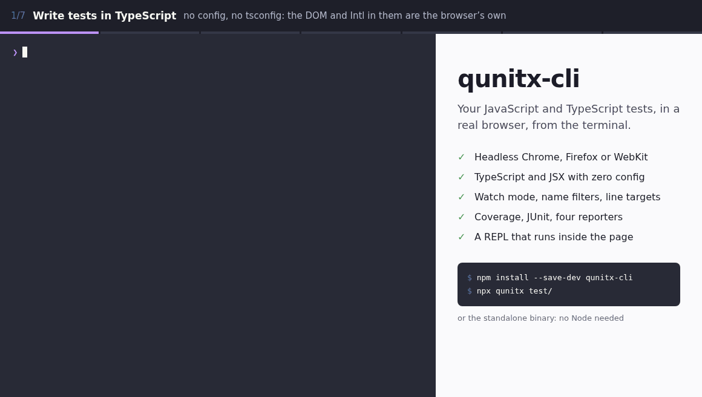

# qunitx-cli

[](https://github.com/izelnakri/qunitx-cli/actions/workflows/ci.yml)
[](https://codecov.io/gh/izelnakri/qunitx-cli)
[](https://www.npmjs.com/package/qunitx-cli)
[](https://www.npmjs.com/package/qunitx-cli)
[](LICENSE)

Browser-based test runner for [QUnitX](https://github.com/izelnakri/qunitx) — bundles your JS/TS tests
with esbuild, runs them in a headless browser via [Playwright](https://playwright.dev), and streams TAP
output to the terminal.



## Features

- Runs `.js`, `.ts`, `.jsx`, and `.tsx` test files in headless Chrome, Firefox, or WebKit (Playwright + esbuild)
- TypeScript and JSX work with zero configuration — esbuild handles transpilation, including the React 17+ automatic JSX runtime
- Bring your own esbuild plugins through `package.json` for `.vue`, `.svelte`, and other custom loaders
- Inline source maps for accurate stack traces pointing to original source files
- Streams TAP-formatted output to the terminal in real time
- Concurrent mode (default) splits test files across all CPU cores for fast parallel runs
- `--watch` mode re-runs affected tests on file change
- `--failFast` stops the run after the first failing test
- `--only-failed` / `-f` re-runs only the test files that failed on the previous run (cached in `tmp/.qunitx-last-failures.json`)
- `--filter` / `-t` / `--module` / `-m` / `-n` — one test filter, five spellings, matched against `"Module: test name"`: substring, `/regex/`, `/regex/i`, or `!` to invert
- `--search` / `-s` / `--print` / `--preview` lists the tests a filter matches and exits, without running them (no browser — instant)
- `file.ts#34` / `file.ts:34` runs just the test at that line — or the whole module, when the line is a `module(...)`
- `--debug` prints the local server URL and pipes browser console to stdout
- `--open` / `-o` opens the test output in the same browser the tests run in as soon as the bundle is ready; `--open=brave` opens in a specific binary instead
- `--before` / `--after` hook scripts for server setup and teardown
- `--timeout` controls the maximum ms to wait for the full suite to finish
- `--port` / `-p` defaults to 1234 and auto-increments if taken; fails fast if an explicit port is unavailable
- `--browser` flag to run tests in Chromium, Firefox, or WebKit
- `--reporter` picks the stdout format: `tap` (default), `spec`, `dot`, or `github` (annotates failures on the PR diff)
- `--junit` writes a JUnit XML report for CI dashboards, alongside the normal terminal output
- `--coverage` reports V8 line coverage (terminal summary, plus optional `lcov` and `html` reports)
- `--version` / `-v` prints the installed version
- [JavaScript API](#javascript-api) — `await run('test/')` returns the results as data; silent by default, with `watch`, `search`, custom reporters and daemon control. On npm and JSR (`jsr:@izelnakri/qunitx-cli/api`)
- Optional daemon mode (`qunitx daemon start`) keeps Chrome and the esbuild context warm across runs — roughly halves the wall-clock time of repeated invocations
- Docker image for zero-install CI usage

## Installation

Requires Node.js >= 24 or Deno >= 2.7.

```sh
npm install --save-dev qunitx-cli
```

Or run without installing:

```sh
npx qunitx test/**/*.js
```

With Docker — no install needed:

```sh
docker run --rm -v "$(pwd):/code" -w /code ghcr.io/izelnakri/qunitx-cli:latest npx qunitx test/**/*.js
```

With Nix:

```sh
nix profile install github:izelnakri/qunitx-cli
```

Standalone binary — no Node or Deno required at runtime (Linux x64, macOS arm64, Windows x64):

```sh
curl -fsSL https://raw.githubusercontent.com/izelnakri/qunitx-cli/main/install.sh | sh
export PATH="$HOME/.qunitx:$PATH"
```

Already on Deno? `deno install` resolves the bootstrap which fetches the matching prebuilt binary on first run and caches it under `~/.cache/qunitx/`:

```sh
deno install -Agf jsr:@izelnakri/qunitx-cli
```

Pin a version or change the install location with env vars:

```sh
VERSION=v0.25.0 INSTALL_DIR=$HOME/.local/bin sh install.sh
```

The script downloads the matching `qunitx-deno-<target>.tar.gz` (or `.zip` on
Windows) from GitHub Releases — a `deno compile`d binary plus the matching
esbuild sidecar — and unpacks both into `$INSTALL_DIR`. A system Chrome on
`PATH` (or `CHROME_BIN`) is the only remaining runtime dependency for the
default `--browser=chromium`.

Build the same binary yourself from source:

```sh
deno task build:binary       # → dist/qunitx for the host platform
make build-deno              # same, plus copies the local @esbuild sidecar next to it
make build-deno-all          # cross-compiles every supported platform
```

## Usage

```sh
# Single file
qunitx test/my-test.js

# Multiple files / globs
qunitx test/**/*.js test/**/*.ts

# TypeScript — no tsconfig required
qunitx test/my-test.ts

# Watch mode: re-run on file changes
qunitx test/**/*.js --watch

# Stop on the first failure
qunitx test/**/*.js --failFast

# Re-run only the files that failed last time (from the persistent failure cache)
qunitx test/ --only-failed   # or: -f, --failed

# Filter by name. -t, --filter, -m and --module are FOUR SPELLINGS OF ONE FLAG:
# all match against "Module: test name", so they find modules and test names alike.
qunitx test/ -t 'renders the header'
qunitx test/ -m Cart              # everything under/named Cart (substring)
qunitx test/ -t Coupons           # finds a nested module by its own name

# Values may be unquoted and multi-word, up to the next flag:
qunitx test/ -m Cart checkout           # filter "Cart checkout"
qunitx -t adds to cart --reporter=spec  # filter "adds to cart", then --reporter
# The value is greedy, so put file targets BEFORE the filter, or after `--`:
qunitx -t adds to cart -- test/cart     # filter "adds to cart", target test/cart

# Substring is case-INsensitive; a regex is case-SENSITIVE unless you add /i:
qunitx test/ -t cart        # matches Cart, ShoppingCart, CartItem, Cart checkout
qunitx test/ -t '/cart/'    # matches nothing — regexes are case-sensitive
qunitx test/ -t '/cart/i'   # matches all of them again
qunitx test/ -t '!slow'     # invert (also works as !/regex/)

# EXACT MODULE: to match one module and its children but NOT its lookalikes
# (ShoppingCart, CartItem, Cart checkout), anchor with ^ and require ": " or " > ":
qunitx test/ -t '/^Cart(:| >)/'   # Cart + Cart > Coupons only
qunitx test/ -t '/^Cart: /'       # Cart's own tests, without nested children

# Preview what a filter matches WITHOUT running anything (no browser — instant).
# Each line is the QUnit name plus a location you can paste back as a line target.
qunitx test/ --print              # list every test
qunitx test/ -s Cart              # list what `-t Cart` would run
#   Cart: adds item               test/cart-test.ts#4
#   Cart > Coupons: applies code  test/cart-test.ts#6
#   2 of 5 tests match "Cart" in 1 file

# Run the test at a line — paste a location straight from a stack trace
qunitx test/cart-test.ts#34   # or: test/cart-test.ts:34

# Print the server URL and pipe browser console to stdout
qunitx test/**/*.js --debug

# Open output in the test browser as soon as the bundle is ready
qunitx test/**/*.js --open

# Open output in a specific browser binary instead
qunitx test/**/*.js --open=brave
qunitx test/**/*.js --open=google-chrome-lts

# Custom timeout (ms)
qunitx test/**/*.js --timeout=30000

# Run a setup script before tests (can be async — awaited automatically)
qunitx test/**/*.js --before=scripts/start-server.js

# Run a teardown script after tests (can be async)
qunitx test/**/*.js --after=scripts/stop-server.js

# Run in Firefox or WebKit instead of Chromium
qunitx test/**/*.js --browser=firefox
qunitx test/**/*.js --browser=webkit
```

> **Prerequisite for Firefox / WebKit:** install the Playwright browser binaries once:
>
> ```sh
> npx playwright install firefox
> npx playwright install webkit
> ```

## JavaScript API

Everything the CLI does, available as a function — for CI scripts, editor integrations, agents,
and anything else that needs the results as data rather than as text on a terminal.

```js
import { run } from 'qunitx-cli';

const result = await run('test/');

result.ok; // false
result.counts; // { total: 42, passed: 41, failed: 1, skipped: 0, todo: 0, assertionsFailed: 1 }
result.failures.map((test) => test.fullName); // ['Cart > Coupons: applies code']
```

Four things to know:

- **Nothing is printed unless you ask.** The returned result is the whole answer. Pass
  `reporter: 'tap'` (or `'spec'`, `'dot'`, `'github'`) to get the CLI's output too.
- **Failing tests are not an error.** `run()` resolves with `ok: false`. It rejects only when the
  run could not happen — a bad option, an unreadable input, no `package.json`.
- **It is lazy.** These return a `Task` (a Promise superset), so nothing starts until you `await`.
- **It is the same engine as the CLI**, taking the same code path, so behaviour cannot drift.

### run

```js
import { run } from 'qunitx-cli';

const result = await run({
  inputs: ['test/', 'src/cart-test.ts#34'], // same grammar as the command line
  filter: 'Cart',
  browser: 'chromium',
  coverage: { formats: ['lcov'] },
  junit: true,
  reporter: 'spec', // omit for silence
});

result.tests; // every test: name, modules, fullName, status, durationMs, assertions, file
result.failedFiles; // absolute paths, attributed through source maps
result.notices; // qunitx's own `# …` diagnostics, as data — see below
result.browserLogs; // console.* and uncaught errors from the page (newest 1000)
result.browserLogsTruncated; // how many were dropped past that cap
result.coverage; // per-file line coverage, or null
result.junitXml; // the XML document, or null
result.startedAt; // epoch ms
result.finishedAt; //  ″
result.groupCount; // how many concurrent groups the files were split across
result.aborted; // true when something stopped the run — see below
result.resolved; // { browser, projectRoot, output, port, extensions, coverageFormats, filter? }
```

`resolved` answers questions the caller cannot recover from what it passed in — chiefly which
browser ran, and which port was actually bound (it auto-increments past a busy one).

`file` on a test is populated **for failures only**: QUnit's `testEnd` carries no file, so the
path is recovered from the failing assertion's stack through the source map. A passing test
leaves no stack to map.

`aborted` distinguishes *stopped* from *red* — both end with `ok: false`. Check it before
reporting failures, or a UI says "3 failures" when someone pressed stop. Pass a `signal` to
cancel; an already-aborted one answers without launching a browser at all.

```js
const controller = new AbortController();
const result = await run({ inputs: ['test/'], signal: controller.signal });
result.aborted; // true — counts are a prefix of the suite, not a verdict on it
```

### Notices — why `ok` alone is not enough

`notices` are every `# …` line the CLI prints, as structured data. They matter because `ok` is
ambiguous on its own:

```js
const result = await run({ inputs: ['test/'], onlyFailed: true });
result.ok;           // true
result.counts.total; // 0   ← nothing ran, and a gate checking `ok` would pass
result.notices;      // [{ level: 'info',
                     //    message: 'qunitx --only-failed: no previously-failing test files to run' }]
```

Each carries a `level`: `info` (a decision qunitx made), `warning` (a surprise), `error` (also
went to stderr). So a cheap gate is `result.notices.some((n) => n.level !== 'info')`. Typical
ones: a filter that matched nothing, `--changed` narrowing the run, a line target superseded by a
broader input, coverage skipped on a non-chromium browser, build errors, timeouts.

They are *not* captured stdout — text is a rendering **of** these, not their source. To capture
the rendered text instead, pass `reporter` and `stdout`.

Every CLI flag has an option; see the [CLI Reference](#cli-reference). `run('test/')` and
`run(['a.ts', 'b.ts'])` are shorthand for `inputs`.

### watch

An async-iterable session that yields a complete result per rerun, and closes deterministically.
No keyboard shortcuts are installed and your stdin is left alone — the behaviours behind them are
methods instead.

```js
import { watch } from 'qunitx-cli';

const session = await watch({ inputs: ['test/'] });
console.log(session.url); // http://localhost:1234

for await (const result of session) {
  console.log(`${result.counts.passed}/${result.counts.total}`);
  if (result.ok) break; // breaking out closes the session
}
```

The session is a handle with the same verbs the CLI's keyboard shortcuts are bound to — the CLI
binds keys to these methods, so a terminal UI built on this API is not reimplementing them:

```js
await session.run(files?); // rerun, optionally scoped     (the file watcher's own path)
await session.runAll(); // whole suite, drops line targets  (`qa`)
await session.runFailed(); // only what failed last run     (`qf`)
await session.abort(); // stop the run in flight            (`qq`)
await session.close(); // release the browser and the port

session.latest; // the most recent result, without consuming the iteration
session.running; // is a run executing or queued
```

Both feeds are **Streams**, so the combinators are already attached — no wrapper:

```js
// notify on the first red run, and stop watching for it
const [red] = await session.results().filter((r) => !r.ok).take(1).collect();

// every event of every rerun, flat and in order — for progress bars and live logs
await session.events().filter((e) => e.kind === 'test').forEach(render);
```

`results()` is one complete `RunResult` per rerun; `events()` is the fine-grained view. The
session stays a *handle* rather than being a Stream itself: combinators return new Streams, and
one with no `close()` would leave a browser with no owner.

### runSession

One run, watched as it happens. `run()` is the smaller thing when only the outcome matters; this
is for when the *progress* is the point.

```js
import { runSession } from 'qunitx-cli';

await using session = await runSession('test/');

for await (const event of session) {
  if (event.kind === 'test') process.stdout.write(event.test.status === 'passed' ? '.' : 'F');
}

const result = await session.result(); // RunResult — never undefined
```

Events are `runStart`, `test`, `notice`, `browserLog`, and finally `runEnd`, which carries the
complete result — so a consumer reading only this feed never needs a second channel. Watch
sessions emit the same shape, so a display written against one works against the other.

**The run does not start until you consume it.** That is the correctness property, not an
optimization: a browser cannot be told to slow down, so a run started before anyone was reading
would either drop events or buffer the whole suite. Awaiting `result()` counts as consuming.

The event feed is capped, so a consumer that falls behind under a flood of page output loses the
oldest events — `session.droppedEvents` says how many, `0` in any ordinary run. `runEnd` is
emitted last and always survives, so the result reaches you either way.

### search

Lists what a selection would run, without running it — no browser, no bundle, milliseconds.

```js
import { search } from 'qunitx-cli';

const { matches, total } = await search({ filter: 'Cart' });
matches.map((test) => `${test.fullName}  ${test.file}#${test.line}`);
```

### Custom reporters

A reporter is any object with the handlers it cares about. Pass an instance as `reporter`; it can
sit alongside a built-in one. A reporter that throws costs its own output and nothing else.

Passing an object does **not** turn on printing — only a built-in _name_, or an explicit
`stdout`, does. So a collector of your own keeps the run silent.

```js
await run({
  reporters: [
    'tap',
    {
      onRunStart: (config, info) => {},
      onTestEnd: (config, details) => {},
      onNotice: (config, notice) => {}, // qunitx's own diagnostics
      onBrowserLog: (config, log) => {}, // console.* from the page
      onRunEnd: (config, info) => {},
    },
  ],
  console: streamConsole(myWritable), // capture what the built-ins print
});
```

To watch a run as it happens with the *public* shapes — `TestResult`, `Notice`, `BrowserLog` —
use `runSession().events()` rather than a reporter; the reporter hooks are the internal ones.

### daemon

Reuses a persistent browser and warm bundle across runs — worth roughly 800 ms per run once it
is up. `Daemon.run` takes the options that survive a socket, so plugin objects, reporter
instances and callbacks are a compile error rather than a silent drop.

```js
import { Daemon } from 'qunitx-cli';

await Daemon.start();
const result = await Daemon.run({ inputs: ['test/'] }); // same RunResult
await Daemon.status(); // { running: true, pid, cwd, socketPath, … }
await Daemon.stop();
```

### Errors

Declared failures are discriminable values, not messages to parse.

```js
import { run, Failure } from 'qunitx-cli';

const outcome = await run({ browser: 'netscape' }).result(); // never throws
if (Failure.is(outcome)) {
  outcome.code; // 'InvalidOption'
  Failure.format(outcome); // 'Invalid `browser` value: "netscape". Expected one of …'
}
```

`await run(…)` throws the same failure instead, if you prefer `try`/`catch`.

A runnable end-to-end example lives in
[`examples/js-api-quality-gate.ts`](examples/js-api-quality-gate.ts) — search, run, coverage
floor, JUnit, a custom reporter, and failure handling in one script.

### Deno and TypeScript

From JSR:

```ts
import { run } from 'jsr:@izelnakri/qunitx-cli/api';
```

The package also ships its TypeScript sources on npm, so Deno and Node 24 can import them
directly:

```ts
import { run } from 'qunitx-cli/lib/api/index.ts';
```

Types are shipped for the bundled entry too — `import { run, type RunResult } from 'qunitx-cli'`
typechecks under `--strict`.

## Daemon mode

**`qunitx daemon start` is optional.** Set `QUNITX_DAEMON=1` once (in your shell, `.env`, or a CI step) and plain `qunitx <file>` invocations auto-spawn the daemon on first use, then transparently route through it on every run after — no extra commands, no flags, nothing to remember between invocations. The explicit `daemon start` / `stop` subcommands exist only for when you want to control the lifecycle yourself.

What it does: cold-start cost dominates a single `qunitx` run — launching Chrome, loading playwright-core, and creating an esbuild incremental context together account for most of the wall-clock time on a small suite. The daemon keeps all three resources alive across runs so subsequent invocations skip them entirely — roughly **2-3× faster** on repeated runs of the same suite.

A single one-off run won't get faster from spinning the daemon up; it's an opt-in optimization aimed at two situations:

- **Local TDD loops.** Export `QUNITX_DAEMON=1` in your shell profile (or run `qunitx daemon start` once at the top of your session) and forget about it — subsequent runs reuse the daemon automatically until you `daemon stop` or 30 idle minutes pass. Override the idle window with `QUNITX_DAEMON_IDLE_TIMEOUT` (`1h`, `45s`, `500ms`; bare numbers are minutes), or set it to `false` to disable auto-shutdown entirely.
- **Monorepo CI** where each package shells out to `qunitx` separately. Set `QUNITX_DAEMON=1` for the job and a single daemon is auto-spawned and reused across every package's invocation.

```sh
# Start a background daemon for this project
qunitx daemon start

# Run tests as usual — the cli auto-detects the daemon and routes through it
qunitx test/**/*.ts

# Stop it when you're done
qunitx daemon stop
```

`--watch` and `--open` manage their own browser lifecycle and bypass the daemon automatically. Single-invocation CI jobs (where `CI=1` is set) also bypass it by default — `QUNITX_DAEMON=1` overrides if you want it on anyway.

### Daemon subcommands

```sh
qunitx daemon start    # Launch a detached daemon for this cwd (idempotent)
qunitx daemon stop     # Ask the running daemon to exit and wait until it has
qunitx daemon status   # Print the live daemon's pid, socket, and uptime
qunitx daemon restart  # Stop + start in one step
```

### How it works

`qunitx daemon start` spawns a detached Node process listening on a per-project Unix socket (named pipe on Windows). Subsequent `qunitx` invocations detect the live socket and forward `argv` + `cwd` + `env` to the daemon; the daemon executes the run in-process and streams TAP back to your terminal. Ctrl+C is forwarded — the daemon abandons the in-flight run cleanly and stays up for the next one. A single daemon serves one run at a time; concurrent invocations queue in arrival order.

Running `qunitx daemon start` upfront is optional. With `QUNITX_DAEMON=1` set in your environment, a plain `qunitx <file>` invocation will spawn the daemon on its own when it doesn't find one already running — so the very first run pays the spawn cost and every run after that is warm. Without `QUNITX_DAEMON=1`, the cli skips auto-spawn and just runs locally; `qunitx daemon start` then becomes the explicit way to opt in.

### Debugging the daemon

The daemon process is detached with `stdio: 'ignore'`, so its idle/startup/shutdown output never reaches a terminal. Set `QUNITX_DAEMON_LOG=<path>` before `daemon start` to redirect the daemon's stdout + stderr to a file:

```sh
QUNITX_DAEMON_LOG=/tmp/qunitx-daemon.log qunitx daemon start
tail -f /tmp/qunitx-daemon.log
```

The log captures startup banners, browser-crash recovery, idle-timeout shutdown, package.json-mutation restarts, and any unhandled rejection. During an active run the per-run interceptor still forwards stdout to the client; the log catches everything else.

## Writing Tests

qunitx-cli runs [QUnitX](https://github.com/izelnakri/qunitx) tests — a superset of QUnit with async
hooks, concurrency control, and test metadata.

Migrating from QUnit? Change a single import:

```js
// before
import { module, test } from 'qunit';
// after
import { module, test } from 'qunitx';
```

Example test file — ES modules, npm imports, and nested modules all work out of the box:

```js
// some-test.js (TypeScript is also supported)
import { module, test } from 'qunitx';
import $ from 'jquery';

module('Basic sanity check', (hooks) => {
  test('it works', (assert) => {
    assert.equal(true, true);
  });

  module('More advanced cases', (hooks) => {
    test('deepEqual works', (assert) => {
      assert.deepEqual({ username: 'izelnakri' }, { username: 'izelnakri' });
    });

    test('can import ES & npm modules', (assert) => {
      assert.ok(Object.keys($));
    });
  });
});
```

Run it:

```sh
# Headless Chromium (default, recommended for CI)
qunitx some-test.js

# With browser console output
qunitx some-test.js --debug

# TypeScript — no config needed
qunitx some-test.ts
```

## Configuration

All CLI flags can also be set in `package.json` under the `qunitx` key, so you don't have to repeat them on every invocation:

```json
{
  "qunitx": {
    "inputs": ["test/**/*-test.js", "test/**/*-test.ts"],
    "htmlPaths": ["test/tests.html"],
    "extensions": ["js", "ts", "jsx", "tsx"],
    "output": "tmp",
    "timeout": 20000,
    "failFast": false,
    "port": 1234,
    "browser": "chromium",
    "plugins": []
  }
}
```

| Key          | Default                      | Description                                                                                                                                                                  |
| ------------ | ---------------------------- | ---------------------------------------------------------------------------------------------------------------------------------------------------------------------------- |
| `inputs`     | `[]`                         | Glob patterns, file paths, or directories to use as test entry points. Merged with any paths given on the CLI.                                                               |
| `htmlPaths`  | `[]`                         | Optional HTML templates to run tests inside. Any listed `.html` file that contains `{{qunitxScript}}` or other handlebars-style tokens is treated as a test runner template. |
| `extensions` | `["js", "ts", "jsx", "tsx"]` | File extensions tracked for test discovery (directory scans) and watch-mode rebuild triggers. Add `"mjs"`, `"cjs"`, or any other extension your project uses.                |
| `output`     | `"tmp"`                      | Directory where compiled test bundles are written.                                                                                                                           |
| `timeout`    | `20000`                      | Maximum milliseconds to wait for the full test suite before timing out.                                                                                                      |
| `failFast`   | `false`                      | Stop the run after the first failing test.                                                                                                                                   |
| `port`       | `1234`                       | Preferred HTTP server port. qunitx auto-selects a free port if this one is taken.                                                                                            |
| `browser`    | `"chromium"`                 | Browser engine to use: `"chromium"`, `"firefox"`, or `"webkit"`. Overridden by `--browser` on the CLI.                                                                       |
| `plugins`    | `[]`                         | esbuild plugin specifiers loaded from your `node_modules` and applied to the test bundle. See [esbuild plugins](#esbuild-plugins).                                           |

CLI flags always override `package.json` values when both are present.

## JSX / TSX

`.jsx` and `.tsx` files are picked up automatically — no configuration needed. The bundle uses esbuild's automatic JSX runtime so React 17+ "no `import React`" code just works:

```tsx
// test/button-test.tsx
import { module, test } from 'qunitx';
import { flushSync } from 'react-dom';
import { createRoot } from 'react-dom/client';
import { Button } from '../src/button.tsx';

module('Button', (hooks) => {
  let container;
  hooks.beforeEach(() => {
    container = document.createElement('div');
    document.body.appendChild(container);
  });
  hooks.afterEach(() => container.remove());

  test('renders the label', (assert) => {
    flushSync(() => createRoot(container).render(<Button label="Save" />));
    assert.equal(container.querySelector('button').textContent, 'Save');
  });
});
```

Vue, Preact, Solid, and other JSX dialects work via a one-line override at the top of each file:

```tsx
/** @jsxImportSource vue */
import { createApp } from 'vue';
// ...JSX uses vue/jsx-runtime instead of react/jsx-runtime
```

You can also set `compilerOptions.jsxImportSource` in your `tsconfig.json` to apply the override across a directory.

## esbuild plugins

For file formats esbuild does not handle natively (e.g. `.vue` SFCs, `.svelte`), declare plugin specifiers in `package.json#qunitx.plugins`. qunitx dynamic-imports each one from your project's `node_modules` and passes it to the build:

```json
{
  "qunitx": {
    "extensions": ["js", "ts", "jsx", "tsx", "vue"],
    "plugins": [
      "esbuild-plugin-vue-next",
      ["esbuild-svelte", { "compilerOptions": { "css": "injected" } }]
    ]
  }
}
```

Each entry is one of:

| Form                            | Behavior                                                                                                                                                   |
| ------------------------------- | ---------------------------------------------------------------------------------------------------------------------------------------------------------- |
| `"<package-name>"`              | Imports the package. If the default export is a function, it's called with no arguments to produce the plugin; otherwise the export is used as the plugin. |
| `["<package-name>", <options>]` | Same, but the factory is called with `<options>` as its only argument. Use this form to pass plugin-specific configuration.                                |
| `"./relative/plugin.js"`        | Loads a plugin you wrote yourself. Resolved against the project root (where your `package.json` lives).                                                    |

Don't forget to add the plugin's file extension(s) to `qunitx.extensions` so directory scans and watch-mode rebuilds pick them up.

### Environment variables

| Variable             | Description                                                                                                                                                                                                                                                                                                                                      |
| -------------------- | ------------------------------------------------------------------------------------------------------------------------------------------------------------------------------------------------------------------------------------------------------------------------------------------------------------------------------------------------ |
| `CHROME_BIN`         | Path to the Chrome/Chromium executable. Required on systems where Chrome is not on `PATH` (e.g. many CI environments). Set automatically when using `browser-actions/setup-chrome` in GitHub Actions.                                                                                                                                            |
| `QUNITX_BROWSER`     | Browser engine to use (`chromium`, `firefox`, `webkit`). Equivalent to `--browser` on the CLI. Useful in CI matrix jobs.                                                                                                                                                                                                                         |
| `NODE_COMPILE_CACHE` | Standard Node env, auto-enabled by qunitx. Stores V8 bytecode for the CLI + its dep graph on disk so the second and subsequent `qunitx` runs skip the parser pass — measured ~8% faster end-to-end (more on slow CI disks). Defaults to `${TMPDIR}/node-compile-cache`; set to a path to relocate (handy for a CI cache key) or `""` to disable. |

If you do not provide any HTML template, qunitx falls back to its built-in `test/tests.html` boilerplate internally, so `qunitx init` is optional.

You can also pass a custom HTML file on the CLI:

```sh
qunitx test/**/*.js custom.html
```

If that file contains `{{qunitxScript}}`, qunitx injects the runner script block at that exact spot. If it contains other handlebars-style tokens (e.g. `{{applicationName}}`), qunitx still treats it as a custom runner template and injects the runner before `</body>`.

The `{{qunitxScript}}` placeholder is replaced with a `<script>` tag containing the WebSocket runtime, QUnit event hooks, and the bundled test code.

## CLI Reference

```
Usage: qunitx [files/folders...] [options]

Options:
  --watch, -w         Re-run tests on file changes
  --failFast          Stop after the first failure
  --only-failed, -f   Re-run only the files that failed on the previous run (alias: --failed)
  --filter, -t        Run only tests matching "Module: test name"  (substring, /regex/, !invert)
  --module, -m, -n    Same flag as --filter — one matcher, several spellings
  --search, -s        List the tests the filter matches, then exit without running them
  --print             Same flag as --search
  --preview           Same flag as --search
  --reporter, -r      stdout format: tap, spec, dot, github
  --console           Alias for --debug
  --debug             Print the server URL; pipe browser console to stdout
  --timeout=<ms>      Max ms to wait for the suite to finish  [default: 20000]
  --output=<dir>      Directory for compiled test assets     [default: ./tmp]
  --extensions=<...>  Comma-separated file extensions to track  [default: js,ts,jsx,tsx]
  --before=<file>     Script to run (and optionally await) before tests start
  --after=<file>      Script to run (and optionally await) after tests finish
  --open, -o          Open output in the test browser as soon as the bundle is ready
  --open=<binary>     Open output in a specific browser binary (e.g. brave, google-chrome-lts)
  --port=<n>, -p=<n>  HTTP server port (auto-selects a free port if taken)
  --browser=<name>    Browser engine: chromium (default), firefox, or webkit
  --reporter=<name>   Stdout format: tap, spec, dot, github  [default: tap]
  --junit[=<path>]    Also write a JUnit XML report  [default: <output>/junit.xml]
  --coverage[=fmts]   Collect V8 line coverage (chromium only). fmts: lcov,html (comma-separated)
  --no-daemon         Don't use the daemon for this run — skips a running daemon and prevents QUNITX_DAEMON auto-spawn

Subcommands:
  qunitx daemon start | stop | status     Manage the optional persistent daemon
  qunitx init                             Bootstrap qunitx config + base HTML in this project
  qunitx new <testFileName>               Create a new qunitx test file
```

## JUnit reports

Most CI dashboards ingest JUnit XML but not TAP. `--junit` writes one **in addition to** the
terminal output, so `--reporter` keeps owning stdout.

```bash
qunitx test/ --junit                    # writes tmp/junit.xml
qunitx test/ --junit=reports/junit.xml  # custom path
```

- One `<testsuite>` per QUnit module; each test is a `<testcase>`.
- Failures carry a `<failure>` with the message and a stack mapped back to your source.
- Skipped and `todo` tests are reported as `<skipped/>`.
- Settable as `junit` under `qunitx` in `package.json`.

## Code coverage

`--coverage` collects **V8 line coverage** of your test bundle over the Chrome DevTools Protocol
and maps it back through the bundle's source map to your original files. Because everything is
bundled, only the non-test source your tests actually import is reported — test files and
`node_modules` are excluded, and code eliminated by tree-shaking (never shipped to the browser)
does not appear.

```bash
qunitx test/                    # terminal summary only
qunitx test/ --coverage=lcov    # + tmp/coverage/lcov.info  (Codecov, Coveralls, GitLab, genhtml)
qunitx test/ --coverage=html    # + tmp/coverage/index.html (self-contained, line-highlighted)
qunitx test/ --coverage=lcov,html
```

- Chromium only — Firefox/WebKit runs print a warning and skip coverage.
- The terminal summary is always printed when `--coverage` is on; `lcov`/`html` are additive.
- Reports are written under `<output>/coverage/`.

## Timezone

The browser inherits the **OS system timezone** automatically — no Playwright `timezoneId` option is involved. The browser's `Intl.DateTimeFormat().resolvedOptions().timeZone` will match the timezone that Node.js itself reads from the OS.

### Setting a timezone for tests

| Platform    | How Chrome resolves the timezone                        | Override                                                                       |
| ----------- | ------------------------------------------------------- | ------------------------------------------------------------------------------ |
| **Linux**   | glibc reads `TZ` env var first, then `/etc/localtime`   | `TZ=America/New_York npx qunitx …` works                                       |
| **macOS**   | CoreFoundation reads the system timezone (ignores `TZ`) | Must set the system timezone: `sudo systemsetup -settimezone America/New_York` |
| **Windows** | Reads the registry timezone (ignores `TZ`)              | Must set the system timezone: `tzutil /s "Eastern Standard Time"`              |

On Linux, the `TZ` env var is the simplest way to run tests in a specific timezone:

```sh
TZ=UTC npx qunitx test/**/*.ts
TZ=America/Los_Angeles npx qunitx test/**/*.ts
TZ=Europe/Berlin npx qunitx test/**/*.ts
```

### CI pitfalls

GitHub Actions (and most CI providers) run with **UTC** by default on all platforms. This is usually what you want for reproducible test results. If your tests assert on specific local times or date formatting, be aware:

**Linux CI** — override with `TZ` in your workflow step:

```yaml
- run: npx qunitx test/**/*.ts
  env:
    TZ: America/New_York
```

**macOS CI** — `TZ` does not affect Chrome. Set the system timezone before running tests:

```yaml
- run: sudo systemsetup -settimezone America/New_York
- run: npx qunitx test/**/*.ts
```

**Windows CI** — same constraint, use `tzutil`:

```yaml
- run: tzutil /s "Eastern Standard Time"
- run: npx qunitx test/**/*.ts
```

If your test suite does not assert on local times or timezone-sensitive date formatting, none of this matters — the default UTC CI timezone is fine.

### Mocking dates and times in tests

For most cases you do not need to touch system settings or env vars at all. `Date`, `Intl`, and timers are plain browser globals — mock them in a qunitx `before` / `beforeEach` hook just like any other value:

```js
// test/some-test.ts
import { module, test } from 'qunitx';

module('Invoice formatting', (hooks) => {
  let realDate;

  hooks.before(() => {
    realDate = globalThis.Date;
    // Pin "now" to a fixed instant for the whole module
    const FIXED = new realDate('2024-06-01T12:00:00Z');
    globalThis.Date = class extends realDate {
      constructor(...args) {
        super(args.length ? args : [FIXED]);
      }
      static now() {
        return FIXED.getTime();
      }
    };
  });

  hooks.after(() => {
    globalThis.Date = realDate;
  });

  test('formats the current date correctly', (assert) => {
    assert.equal(new Date().toISOString().slice(0, 10), '2024-06-01');
  });
});
```

For richer control over timers (`setTimeout`, `setInterval`, `requestAnimationFrame`, …) use a fake-timer library such as [Sinon.JS](https://sinonjs.org/releases/latest/fake-timers/):

```js
import sinon from 'sinon';

module('Debounce logic', (hooks) => {
  let clock;

  hooks.before(() => {
    clock = sinon.useFakeTimers({ now: new Date('2024-06-01T00:00:00Z') });
  });
  hooks.after(() => {
    clock.restore();
  });

  test('fires after 300 ms', (assert) => {
    // clock.tick(300) advances fake time without waiting in real time
    clock.tick(300);
    assert.ok(/* your assertion */);
  });
});
```

If you need the mock active across the entire test run rather than inside a single module, put it in a `--before` script:

```js
// scripts/mock-date.js  (passed as: qunitx … --before=scripts/mock-date.js)
const realDate = globalThis.Date;
const FIXED = new realDate('2024-06-01T12:00:00Z');

globalThis.Date = class extends realDate {
  constructor(...args) {
    super(args.length ? args : [FIXED]);
  }
  static now() {
    return FIXED.getTime();
  }
};
```

This runs in the browser context before any test module loads, so every test in the run sees the mocked `Date` with no changes to the OS, no env vars, and no qunitx-cli configuration.

## Development

```sh
npm install
make check                      # lint + test (run before every commit)
make test                       # run full test suite (Chromium)
make test-firefox               # run browser tests with Firefox
make test-webkit                # run browser tests with WebKit
make test-all-browsers          # run full suite on all three browsers
make demo                       # regenerate docs/demo.gif
make release LEVEL=patch        # bump version, update changelog, tag, push
```

For a tight TDD loop on this repo (or any consuming project), run `qunitx daemon start` once at the top of your session — every subsequent `qunitx` invocation reuses the warm Chrome and esbuild context, roughly halving the wait-per-iteration. AI/LLM coding agents benefit even more, since their inner loop is dozens of `qunitx <file>` invocations per feature. Caveat: agents running inside containers or CI-style environments (GitHub Actions Copilot, sandboxed coding agents) often have `CI=1` set, which bypasses the daemon by default — set `QUNITX_DAEMON=1` in those environments to opt back in.

Use `--trace-perf` to print internal timing to stderr — useful when investigating startup or e2e regressions:

```sh
qunitx test/my-test.js --trace-perf
```

## License

MIT
